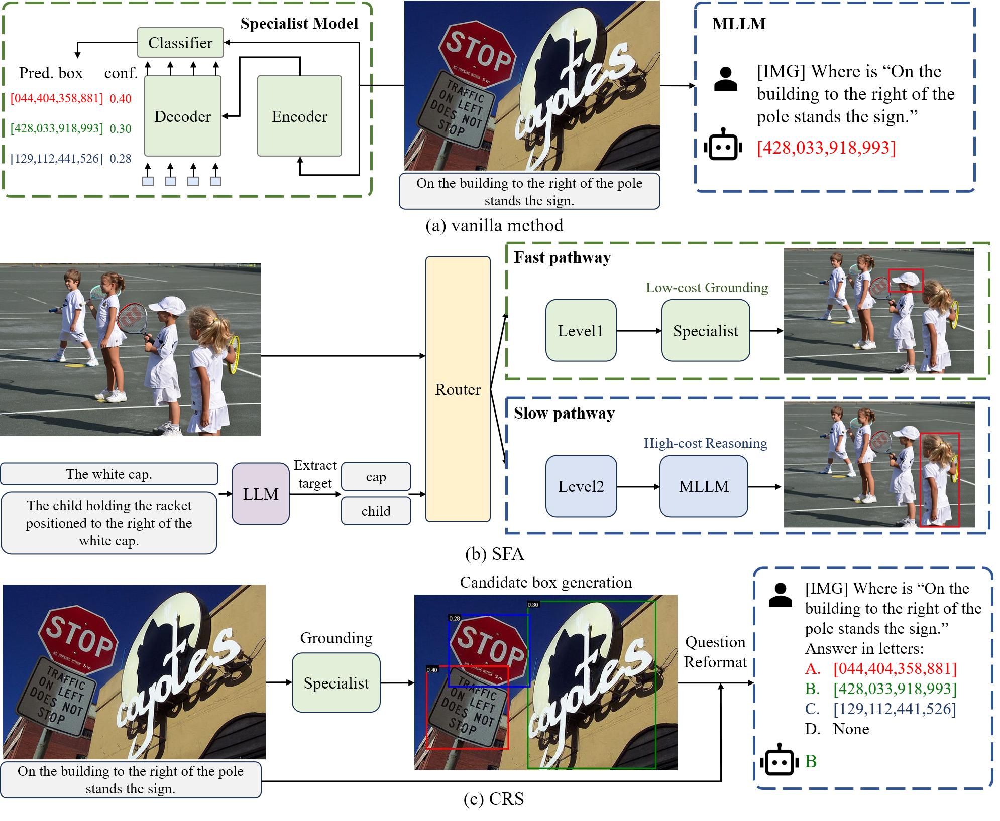

# New Dataset and Methods for Fine-Grained Compositional Referring Expression Comprehension via Specialist-MLLM Collaboration  

## 📜 News 

🔥 **[2025/06/12]** We open-sourced the methods developed via **Specialist–MLLM collaboration**, including **Slow-Fast Adaptation (SFA)** and **Candidate Region Selection (CRS)**.

🔥 **[2025/06/01]** Our extended paper was accepted by **TPAMI 2025**.

🔥 **[2024/09/20]** Our previous paper was accepted by **EMNLP 2024**.

🔥 **[2024/06/17]** Released the **[FineCops-Ref dataset](https://github.com/liujunzhuo/FineCops-Ref)** — featuring controlled difficulty levels and challenging negative samples.

## ✒️ Contents
- [News](#news)
- [Contents](#contents)
- [Overview](#overview)
- [Preparation](#preparation)
- [Usage](#usage)
- [Citation](#citation)

## 👀 Overview

**Referring Expression Comprehension (REC)** is a foundational cross-modal task that evaluates the interplay of language understanding, image comprehension, and language-to-image grounding. It serves as an essential testing ground for Multimodal Large Language Models (MLLMs). To advance this field, we introduced a new REC dataset in our previous conference paper, characterized by two key features. First, it is designed with **controllable difficulty levels**, requiring multi-level fine-grained reasoning across object categories, attributes, and multi-hop relationships. Second, it incorporates **negative text and images** generated through fine-grained editing and augmentation, explicitly testing a model’s ability to reject scenarios where the target object is absent—an often-overlooked yet critical challenge in existing datasets. In this extended work, we propose two new methods to tackle the challenges of fine-grained REC by combining the strengths of Specialist Models and MLLMs. **The first method** adaptively assigns simple cases to faster, lightweight models and reserves complex ones for powerful MLLMs, balancing accuracy and efficiency. **The second method** lets a specialist generate a set of possible object regions, and the MLLM selects the most plausible one using its reasoning ability. These collaborative strategies lead to significant improvements on our dataset and other challenging benchmarks. Our results show that combining specialized and general-purpose models offers a practical path toward solving complex real-world vision-language tasks.

<div align=center>

</div>


## 👨‍💻 Preparation

1. Download REC Benchmarks:
   - Download the [**FineCops-Ref**](https://github.com/liujunzhuo/FineCops-Ref) dataset.

   - Optionally, download [**Ref-Adv**](https://github.com/aws/aws-refcocog-adv) and [**Ref-Reasoning**](https://github.com/sibeiyang/sgmn) datasets.

   - Place datasets in the `data/` directory (e.g., `data/finecops-ref/`, `data/ref-adv/`, `data/ref-reasoning/`).

2. Download pre-trained model checkpoints:
   - Obtain checkpoints for Specialist Models (e.g., [Grounding DINO](https://github.com/open-mmlab/mmdetection/blob/main/configs/mm_grounding_dino)) and MLLMs (e.g., [Qwen-VL](https://github.com/QwenLM/Qwen2.5-VL), [InternVL](https://github.com/OpenGVLab/InternVL)) from their respective repositories.
   - Place checkpoints in the `checkpoints/` directory.
3. Environment Setup
   - We recommend installing the required environments from their respective repositories. For example:
      - [Grounding DINO](https://github.com/open-mmlab/mmdetection/blob/main/configs/mm_grounding_dino)
      - [CogVLM](https://github.com/THUDM/CogVLM)
      - [Qwen-VL](https://github.com/QwenLM/Qwen2.5-VL)
      - [InternVL](https://github.com/OpenGVLab/InternVL)


## 🎯 Usage
### 1. Baseline

We recommend using the official codebase for evaluation. You only need to modify the data path. In the `Baseline` folder, we provide inference scripts using **Grounding DINO** and **Qwen2-VL**, namely:

- `inference_GD.py` for Grounding DINO
- `inference_QwenVL.py` for Qwen2-VL

For evaluation metrics, please refer to `evaluation_baseline.py`, which includes the computation of **precision**, **recall**, and **AUROC**.

### 2. Slow-Fast Adaptation (SFA)

1. **Target Extraction**
    Use GPT to extract the target from the input expression. See `target_extraction.py`.
2. **Task Routing**
    Use a router (e.g., Grounding DINO) for level assessment and task routing. See `task_routing.py`.
3. **Inference**
    Based on routing results:
   - **Level 1** data is processed using specialist models (e.g., Grounding DINO).
   - **Level 2** data is processed using MLLMs (e.g., Qwen2-VL, InternVL2.5).
4. **Focus-Enhancement Strategy (Optional)**
    To implement the focus-enhancement strategy, simply set the `--focus_enhancement` parameter.
5. **Evaluation**
    Evaluate the inference results using `evaluation_SFA.py`.

<div align=center>

</div>

### 3. Candidate Region Selection (CRS)

1. **Candidate Generation**
    Use specialist models (e.g., Grounding DINO) to generate candidate regions. See `candidate_generation.py`.

2. **Instruction Tuning for Multi-Choice Selection**
    We fine-tune MLLMs with a small subset of RefCOCO data to improve their instruction-following capability, without risking data leakage. The fine-tuning datasets are:

   - `refcoco_CRS_pos.json` (positive examples)
   - `refcoco_CRS_neg.json` (includes "None" options, allowing models to reject hard negatives)

   We recommend using [LLaMA-Factory](https://github.com/hiyouga/LLaMA-Factory) for SFT.

3. **Inference**
    Inference scripts using Qwen2-VL for positive and negative samples are provided in:

   - `region_selection_pos.py`
   - `region_selection_neg.py`

4. **Evaluation**
    Evaluate model performance on both positive and negative samples using:

   - `evaluation_CRS_pos.py`
   - `evaluation_CRS_neg.py`

<div align=center>

</div>

## License

This project is released under the [MIT License](LICENSE).

## Citation
If you use FineCops-Ref or our methods in your research, please cite our work using the following BibTeX entry:
```bibtex
@article{yang2025new,
  title={New Dataset and Methods for Fine-Grained Compositional Referring Expression Comprehension via Specialist-MLLM Collaboration},
  author={Yang, Xuzheng and Liu, Junzhuo and Wang, Peng and Wang, Guoqing and Yang, Yang and Shen, Heng Tao},
  journal={IEEE Transactions on Pattern Analysis and Machine Intelligence},
  year={2025},
}
```
